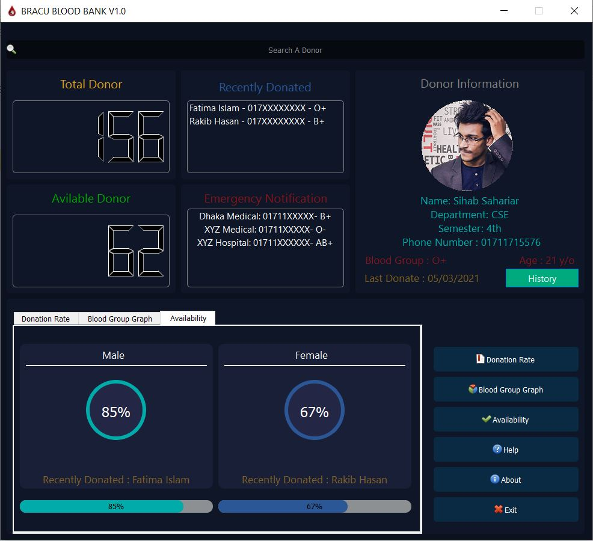

# BRACU-Blood-Bank
A GUI designed in Python using PyQT5 for BRACU Blood Bank. 
Information:
------------
- Programming Language: Python
- Library: PyQt5,Matplotlib,Pandas

Features:
-----------------------
- [x] Developed Graphical User Interface 
- [ ] Backend and database

Screenshot
---------------

          

          

